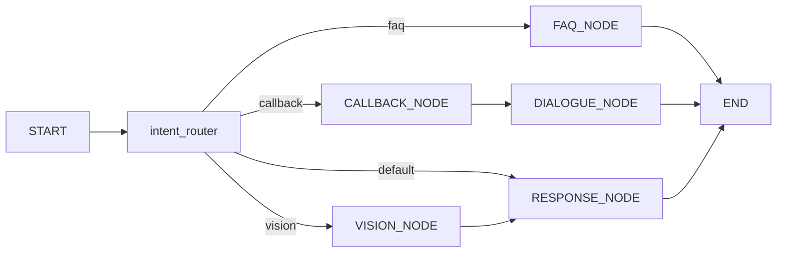

# CallFlow Mini — 상담 흐름 & RAG FAQ 백엔드

FastAPI와 **LangGraph**로 사용자 발화를 **의도(intent)** 에 따라 분기하고, FAQ는 **PDF 약관을 Chroma에 넣은 뒤 벡터 검색(MMR)** 으로 근거를 찾아 **OpenAI**로 답을 생성하는 구조입니다. Twilio 음성 웹훅·Media Stream(STT/TTS)은 별도 라우터로 동작합니다.

---

## 주요 기능

| 영역 | 설명 |
|------|------|
| **의도 분류** | `intent_router`: `faq` / `callback` / `vision` / `default` (구조화 출력, OpenAI `gpt-4o-mini`) |
| **FAQ (RAG)** | 질문에서 키워드 추출 → Chroma MMR 검색 → 검색 결과를 바탕으로 답변 생성 (OpenAI) |
| **콜백** | 이름·전화 수집 후 `callback_tool`, 이어서 `dialogue_manager`에서 Twilio 안내 문구 연동 |
| **일반 응답** | `default` → `RESPONSE_NODE` (OpenAI `gpt-4o-mini`) |
| **비전** | `vision_node` + `vision_tool` (플레이스홀더/목업 성격) |
| **음성** | `dialogue_tool`: `/voice` TwiML, `/media-stream` WebSocket, Deepgram STT, ElevenLabs TTS, OpenAI 대화 |

---

## 아키텍처 (LangGraph)



- **FAQ** 경로는 검색·답변이 `FAQ_NODE`에서 끝나 **`END`로 바로 종료**합니다 (`RESPONSE_NODE`를 타지 않아 검색 결과가 덮어씌워지지 않도록 한 설계).
- **콜백**은 `CALLBACK_NODE` → `DIALOGUE_NODE`에서 최종 문구 확정 후 종료.

---

## 기술 스택

- **런타임**: Python 3.x, FastAPI, Uvicorn  
- **오케스트레이션**: LangGraph, LangChain  
- **LLM (전반)**: OpenAI API (`ChatOpenAI`, 모델은 `app/config.py`의 `OPENAI_LLM_MODEL`)  
- **임베딩·벡터 DB**: `sentence-transformers` + Chroma (`langchain-community`)  
- **PDF 로딩**: PyMuPDF (`pymupdf`)  
- **음성(선택)**: Twilio, Deepgram, ElevenLabs  

---

## 디렉터리 구조

```
final_mini_project/
├── backend/
│   ├── main.py                 # FastAPI 진입, 최상단에서 .env 로드 (override=True)
│   ├── requirements.txt
│   ├── .env                    # 로컬 전용 (커밋하지 않음)
│   ├── data/
│   │   ├── *.pdf               # 약관 등 (여기 두고 인덱싱)
│   │   ├── save.py             # PDF → 청크 → Chroma 빌드
│   │   └── chroma_db/          # 벡터 저장소 (생성됨, .gitignore 권장)
│   └── app/
│       ├── config.py           # 모델명/경로/청킹/MMR 등 상수
│       ├── runtime.py          # 무거운 객체(LLM, Embedding, Chroma) 1회 초기화/공유
│       ├── graph.py            # LangGraph 정의
│       ├── state.py            # CallFlowState
│       ├── nodes/              # intent_router, faq_node, callback_node, …
│       ├── tools/              # faq_tool, callback_tool, dialogue_tool, …
│       └── prompts/            # 프롬프트 문자열
└── frontend/                   # Vite + React (별도 README 참고)
```

---

## 환경 변수

`backend/.env`에 두고, **`main.py`가 앱 import 전에** `backend/.env`를 읽습니다 (`override=True`로 OS에 남아 있는 동일 이름 변수보다 파일이 우선).

| 변수 | 용도 |
|------|------|
| `OPENAI_API_KEY` | 의도 분류, FAQ 키워드/답변 (`ChatOpenAI`) |
| `GOOGLE_API_KEY` | (현재 미사용) 과거 Gemini 경로 호환용으로 남아 있을 수 있음 |
| `DEEPGRAM_API_KEY` | Twilio 스트림 STT |
| `ELEVENLABS_API_KEY` | TTS (선택: `ELEVENLABS_VOICE_ID`) |
| `PING_VOICE_WEBHOOK` | `true` 등이면 콜백 후 로컬에서 `/voice` 확인용 GET (선택) |
| `API_BASE_URL` | 위 ping 시 호출할 베이스 URL (기본 `http://localhost:8000`) |

`.env`는 저장소에 올리지 마세요. `.gitignore`에 포함되어 있습니다.

---

## 설치 및 실행

### 1) 백엔드

```bash
cd backend
python -m venv .venv
.venv\Scripts\activate          # Windows
pip install -r requirements.txt
```

### 2) PDF → Chroma 인덱스 (FAQ 최초 1회 또는 PDF 변경 시)

`backend/data/`에 `.pdf` 파일을 넣은 뒤:

```bash
cd backend
python data/save.py
```

- 임베딩 모델은 `app/config.py`의 `EMBED_MODEL`과 **검색 시(`faq_tool`) 동일**해야 합니다.  
- 모델을 바꾼 뒤에는 **반드시 인덱스를 다시 생성**하세요.

### 3) API 서버

```bash
cd backend
uvicorn main:app --reload --port 8000
```

- 서버 시작 시 `main.py`의 startup 훅에서 `app/runtime.py:init_runtime()`이 실행되어,  
  `ChatOpenAI`, `HuggingFaceEmbeddings`, `Chroma` 객체를 **최초 1회만** 만들고 공유합니다.

### 4) 채팅 API 예시

`POST /chat`  
Body (JSON):

```json
{
  "message": "이용요금 연체하면 어떻게 돼?",
  "collected_name": null,
  "collected_phone": null
}
```

응답:

```json
{ "response": "…최종 텍스트…" }
```

### 5) 프론트엔드 (선택)

```bash
cd frontend
npm install
npm run dev
```

프론트에서 `http://localhost:8000/chat` 등으로 백엔드를 호출하도록 구성합니다.

---

## FAQ 파이프라인 요약

1. **의도**가 `faq`이면 `FAQ_NODE` 실행.  
2. **키워드 추출** 프롬프트로 검색 쿼리를 짧게 만든 뒤 `faq_tool`에 전달.  
3. **Chroma**에서 `max_marginal_relevance_search`(MMR)로 여러 청크를 가져와 문자열로 합침.  
4. **답변**은 `get_faq_prompt`로 만든 전체 문자열을 `llm.invoke(str)`에 넘겨 생성.

검색·임베딩 관련 튜닝은 `app/config.py`의 `FETCH_K`, `MMR_K`, `MMR_LAMBDA`, `EMBED_MODEL`, `CHUNK_*`를 조정합니다.

---

## Twilio / 음성 (요약)

- `app/tools/dialogue_tool.py`에 **`/voice`** (TwiML), **`/media-stream`** (WebSocket) 이 정의되어 있습니다.  
- ngrok URL 등은 코드 내 TwiML 예시와 맞춰 수정해야 합니다.  
- 음성 경로의 LLM도 **OpenAI (`OPENAI_LLM_MODEL`)** 를 사용합니다.

---

## 문제 해결

- **`401` / OpenAI 키 불일치**: 시스템 환경 변수와 `.env` 충돌 시 `main.py`의 `load_dotenv(..., override=True)`가 우선합니다. 서버 재시작 후 확인.  
- **검색 결과가 엉뚱함**: 인덱스 재생성, `EMBED_MODEL` 일치, 청크 크기·`save.py` 분할 설정 검토.  
- **`Invalid input type dict` (FAQ)**: `ChatOpenAI.invoke()`에 템플릿 dict를 넘기지 말고, 완성된 문자열 또는 `프롬프트 | llm` 체인의 `invoke`를 사용합니다.

